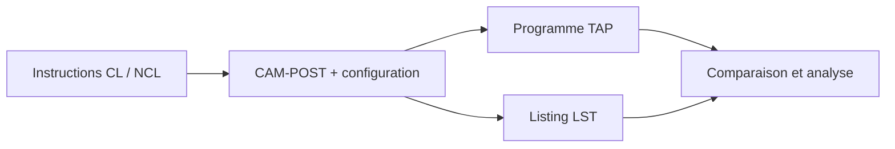

# FAO / CNC — Post-processeur 3 et 5 axes avec CAM-POST

**FAO · Programmation CNC · Post-traitement · Macros · Usinage 3 et 5 axes**

J’ai développé ce post-processeur dans le cadre de ma maîtrise à **l’ÉTS Montréal**, pour le cours **SYS856 — Fabrication assistée par ordinateur**, à l’**automne 2024**.

**Alae ZERROUQ** · Projet individuel · FAO · CNC · CAM-POST · Chaîne CAO/FAO

## Objectif

Adapter le post-traitement de trajectoires FAO à une machine multiaxe : transformer les instructions CL/NCL en programmes de commande numérique, gérer les mots de post-processeur et examiner les sorties à l'aide de listings.

La machine cible présentée dans le projet est une **Hitachi-Seiki 5 axes**. Le dépôt contient la base du post-processeur, un questionnaire de configuration, des cas d'essai et le rapport original.

## Mes compétences mises en pratique

| Domaine | Éléments consultables |
|---|---|
| Configuration de post-processeur | Base `ZERA03.dbf` et listing du questionnaire |
| Chaîne FAO → CNC | Entrées NCL, programmes TAP et listings LST associés |
| Programmation multiaxe | Cas d'essai distincts en 3 et 5 axes |
| Traitement des instructions | Scénarios de mots post-processeur, cycles, changements d'outil et déplacements |
| Analyse et traçabilité | Lecture croisée des entrées, sorties et diagnostics |
| Communication technique | Rapport de session documentant la démarche |

## Chaîne de traitement



Les fichiers fournis permettent d'étudier cette chaîne sans disposer de CAM-POST. Leur régénération nécessite le logiciel et une configuration compatible.

## Organisation

```text
├── README.md
├── postprocessor/
│   ├── ZERA03.dbf
│   └── zera2025 (5).lis
├── examples/
│   ├── 3-axes/                 # f3axes : NCL, TAP, LST
│   ├── 5-axes/                 # f5axes : NCL, TAP, LST
│   ├── mots-postprocesseur/    # fmotsPP-4 : TXT, TAP, LST
│   └── tmark/                  # Deux variantes d'essai
└── docs/
    ├── GUIDE_LECTURE.md
    ├── REORGANISATION.md
    └── Rapport-ZERROUQ-Alaeeddine_Projet-Session_SYS856-A24.pdf
```

## Parcours de lecture

1. Lire le [rapport original](docs/Rapport-ZERROUQ-Alaeeddine_Projet-Session_SYS856-A24.pdf).
2. Comparer l'[entrée 3 axes](examples/3-axes/f3axes.ncl), le [programme produit](examples/3-axes/f3axes.tap) et son [listing](examples/3-axes/f3axes.lst).
3. Explorer le [cas 5 axes](examples/5-axes/) et les [mots post-processeur](examples/mots-postprocesseur/).
4. Consulter le [guide technique](docs/GUIDE_LECTURE.md) pour comprendre les extensions, la configuration et les limites.

## Exemples et résultats disponibles

| Cas | Entrée | Programme | Listing |
|---|---|---|---|
| 3 axes | [NCL](examples/3-axes/f3axes.ncl) | [TAP](examples/3-axes/f3axes.tap) | [LST](examples/3-axes/f3axes.lst) |
| 5 axes | [NCL](examples/5-axes/f5axes.ncl) | [TAP](examples/5-axes/f5axes.tap) | [LST](examples/5-axes/f5axes.lst) |
| Mots post-processeur | [TXT](examples/mots-postprocesseur/fmotsPP-4.txt) | [TAP](examples/mots-postprocesseur/fmotsPP-4.tap) | [LST](examples/mots-postprocesseur/fmotsPP-4.lst) |

Le scénario des mots post-processeur contient notamment `PREFUN`, `INSERT`, `CYCLE/DEEP`, `GOPARK` et `BREAK`. Ce sont des cas à examiner avec leurs sorties ; leur présence seule ne démontre pas la réussite de chaque exigence.

## Outils et reproduction

- **CAM-POST / ICAM QUEST** pour la configuration et le post-traitement.
- **Pro/ENGINEER / Creo** dans la chaîne de génération des données CL décrite par le projet.
- Un éditeur de texte suffit pour parcourir les NCL, TAP, LST et LIS.

Le questionnaire archivé porte l'en-tête **QUEST 24.0-2235** et conserve des libellés génériques **VMC 3-Axis / FANUC MODEL 16 M**, avec des tables rotatives A/B. Leur cohérence avec la machine cible et la base doit être vérifiée lors d'une reproduction ; le dépôt ne fournit pas un environnement industriel clé en main.

Aucun post-traitement ni essai machine n'a été relancé lors de la réorganisation. Les programmes TAP sont des résultats académiques à analyser, pas une validation pour une machine particulière.

## Conservation des fichiers

Les contenus techniques et le rapport sont conservés. La copie identique de `ZERA03.dbf` a été regroupée en un emplacement unique ; les anciens chemins sont recensés dans le [journal de réorganisation](docs/REORGANISATION.md).
